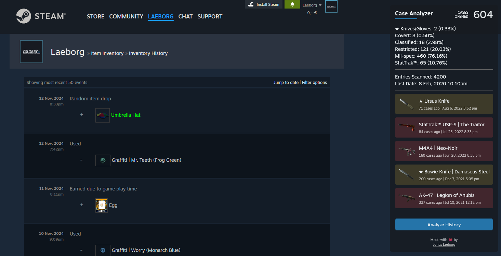

# CS2 Case Opening Analyzer

A Firefox extension that analyzes your CS2 Case Openings directly from your Steam Inventory History page.

## Features

- Tracks total cases opened
- Shows distribution of item rarities
- Displays StatTrak™ statistics
- Lists all unboxed knives/gloves with dates
- Works directly on your Steam Inventory History page

## Installation

1. Download the latest release from the [releases page](https://github.com/laeborg/caseanalyzer-firefox/releases)
2. Open Firefox and go to `about:debugging`
3. Click "This Firefox"
4. Click "Load Temporary Add-on"
5. Select the downloaded file

## Usage

1. Go to your [Steam Inventory History](https://steamcommunity.com/my/inventoryhistory)
2. Make sure the page language is set to English
3. Click the "Analyze History" button that appears in the top right corner
4. Wait for the analysis to complete

## Credits

Made by [Jonas Læborg](https://github.com/laeborg)

## License

MIT License - feel free to modify and reuse
